<div align="center">
  
</div>

<div align="center">
  
[](https://git.io/typing-svg)

</div>

<div align="center">
  
[](https://www.linkedin.com/in/mohamed-elghabouri)
[](http://mohamed-elghabouri.github.io/my_portfolio/)
[](http://www.instagram.com/mohamed_elghabouri/)
[](mailto:elghabouri.moh.fst@uhp.ac.ma)

</div>


##  **About Me**

```javascript
const mohamed = {
    location: "Setta, Morocco 🇲🇦",
    role: "Software Engineer & Full Stack Developer",
    passion: "Transforming ideas into digital reality",
    currentFocus: ["Laravel", "DevOps", "Cloud Architecture"],
    philosophy: "Code is poetry, and every bug is a lesson in disguise",
    contact: "elghabouri.moh.fst@uhp.ac.ma",
    website: "http://mohamed-elghabouri.github.io/my_portfolio/"
};

console.log("Welcome to my digital universe! 🚀");
```

> *"Passionate about development since childhood, I've transformed my natural curiosity for technology into genuine technical expertise."*


##  **Tech Stack**

<div align="center">

### 💻 **Languages**


### 🎨 **Frontend**


### 🔧 **Backend**


### 🗄️ **Databases**


### 📱 **Mobile & AI/ML**


### 🛠️ **DevOps & Tools**


</div>


##  **GitHub Analytics**

<div align="center">
  


</div>

<div align="center">
  


</div>

<div align="center">
  


</div>

<div align="center">
  


</div>


##  **Featured Projects**

<div align="center">

[](https://github.com/Mohamed-ELGHABOURI/E-recrute)

</div>


##  **Current Focus**

<div align="center">



</div>

```mermaid
graph TD
    A[🎯 Current Goals] --> B[🔥 Laravel Mastery]
    A --> C[☁️ DevOps & Cloud]
    A --> D[🏗️ Architecture Design]
    B --> E[Advanced Eloquent]
    B --> F[API Development]
    C --> G[Docker & Kubernetes]
    C --> H[AWS/GCP Services]
    D --> I[Microservices]
    D --> J[System Design]
```

- 🔥 **Laravel:** Diving deep into advanced patterns and best practices
- ☁️ **DevOps:** Mastering containerization and cloud architecture
- 🏗️ **System Design:** Building scalable and maintainable applications
- 🚀 **Innovation:** Always exploring cutting-edge technologies


##  **Fun Facts**

<div align="center">

| Fact | Description |
|------|-------------|
| 👶 **Early Start** | Started coding as a kid - curiosity turned into career! |
| 🌍 **Global Reach** | Based in beautiful Morocco, coding for the world |
| ☕ **Fuel** | Powered by coffee and driven by innovation |
| 🐛 **Philosophy** | Every bug is just a puzzle waiting to be solved |
| 🎵 **Coding Playlist** | Best code is written with epic soundtracks |

</div>


##  **Let's Connect!**

<div align="center">

[](https://www.linkedin.com/in/mohamed-elghabouri)
[](http://mohamed-elghabouri.github.io/my_portfolio/)
[](http://www.instagram.com/mohamed_elghabouri/)
[](mailto:elghabouri.moh.fst@uhp.ac.ma)

</div>

<div align="center">

**💬 Always open to interesting conversations and collaboration opportunities!**

</div>


<div align="center">


<br><br>


**⭐ From [Mohamed ELGHABOURI](https://github.com/Mohamed-ELGHABOURI) with ❤️**

</div>

<!-- Snake Animation -->
<div align="center">
  
</div>
